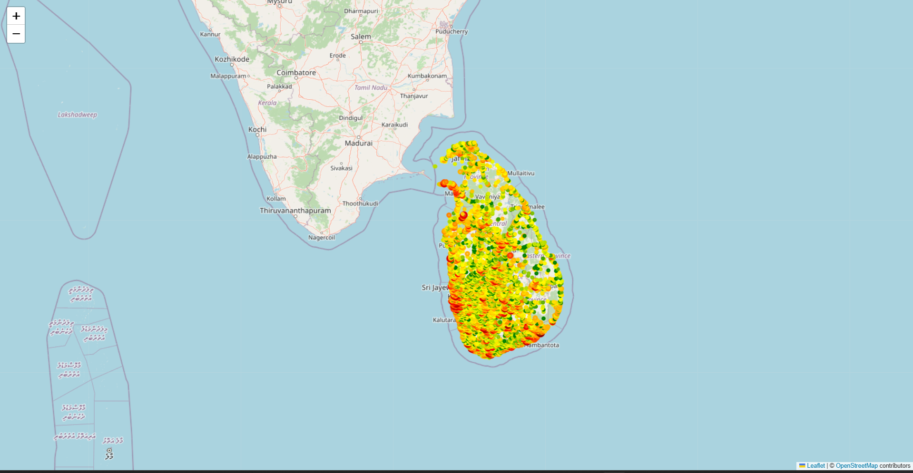

# Bird Data Distribution Visualization

## Overview
This module visualizes the geographic distribution of bird observation data across Sri Lanka. It processes raw bird observation data and creates an interactive density map showing where birds have been spotted across the country.

## What We Did

### 1. **Data Loading & Exploration**
   - Loaded bird observation data from a CSV file containing records with coordinates and locality information
   - Explored the dataset structure including total observations and locality distribution
   - Examined the data shape and value counts to understand data volume

### 2. **Data Cleaning**
   - Removed records with missing latitude and longitude coordinates
   - Ensured all observations used in visualization have valid geographic coordinates

### 3. **Spatial Grid Creation**
   - Created a 0.02°×0.02° grid system by rounding coordinates to 2 decimal places
   - This grid helps aggregate nearby observations into meaningful clusters
   - Each grid cell represents an area roughly 2km × 2km

### 4. **Density Calculation**
   - Counted the number of bird observations within each grid cell
   - Generated grid statistics with observation counts per location

### 5. **Interactive Map Visualization**
   - Created an interactive map using Folium library showing Sri Lanka
   - Implemented a **logarithmic color scale** to handle data variability:
     - **Green**: Low bird observation density
     - **Yellow**: Moderate density
     - **Orange**: Higher density
     - **Red**: Very high density
     - **Dark Red**: Highest concentration of observations
   - Used logarithmic scaling for marker radius to prevent large markers from overwhelming the map
   - Each circle marker is clickable and displays the observation count for that location

## Data Coverage Across Sri Lanka

**Geographic Coverage:** The data points shown on the map demonstrate comprehensive coverage across Sri Lanka:
- **Northern regions** - Including Jaffna and the Vanni area
- **Western coast** - From Colombo extending north and south
- **Central highlands** - Covering mountainous areas of Kandy and Nuwara Eliya
- **Eastern coast** - From Trincomalee to the southern ports
- **Southern regions** - Including Matara and Galle districts

The **color gradient from green (low density) to dark red (high density)** shows observational intensity, with higher concentrations visible in populated areas and habitat hotspots.

## Output File

The visualization generates an interactive HTML map:
- **File:** `bird_density_map.html`
- **Format:** Interactive Leaflet/Folium map
- **Features:** 
  - Pan and zoom functionality
  - Clickable markers showing exact observation counts
  - Color-coded density visualization

## Technical Implementation

### Libraries Used
- **Pandas** - Data manipulation and grid aggregation
- **Folium** - Interactive map creation
- **Matplotlib** - Color scaling and visualization
- **NumPy** - Logarithmic scaling calculations

### Processing Steps
1. Load bird observation data with coordinates and metadata
2. Remove invalid/missing coordinate entries
3. Aggregate observations into 0.02° grid cells (~2km × 2km)
4. Apply logarithmic scaling to handle data distribution
5. Generate HTML interactive map with Folium
6. Visualize with color-coded circle markers

## Key Insights

- **Data completeness:** The dataset covers the entire geographic extent of Sri Lanka
- **Distribution pattern:** Bird observations are concentrated in multiple hotspots rather than uniformly distributed
- **Method effectiveness:** Grid-based aggregation successfully reveals geographic patterns while managing computational performance

---

**Project:** Bird Diversity Analysis  
**Purpose:** Understanding spatial distribution patterns of bird observations across Sri Lanka
